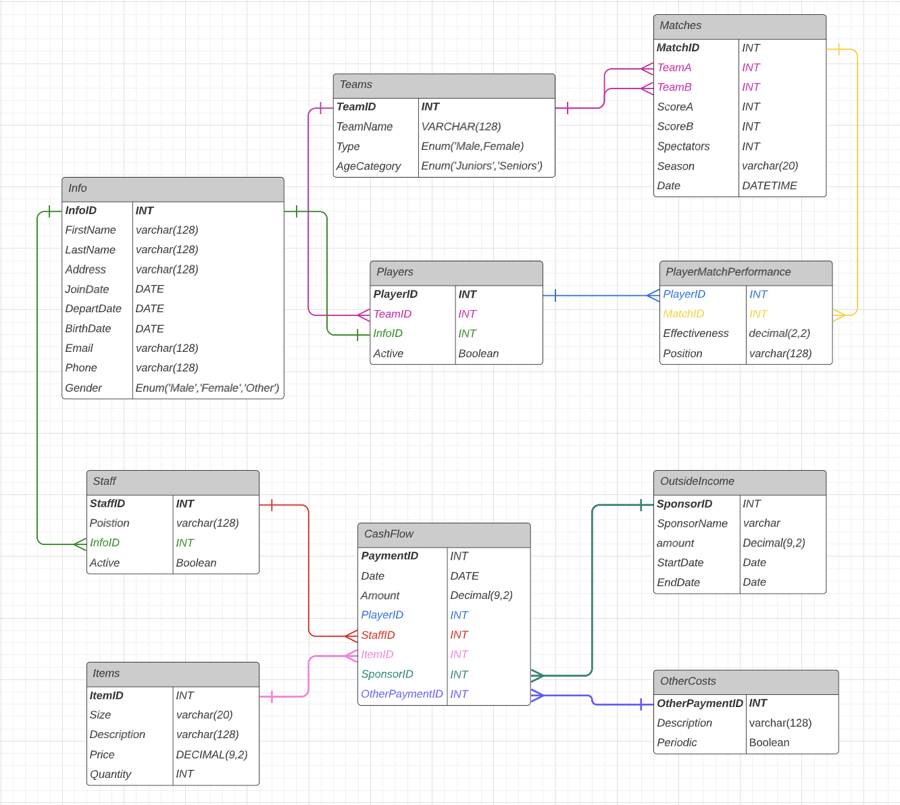

# Curling-Masters

Adres do strony z opisem projektu: http://prac.im.pwr.edu.pl/~giniew/doku.php?id=rok2122:letni:bd:projekt

## Dokumentacja Curling-Masters
- [Joanna Matuszak](https://github.com/vsiv00)
- Joanna Wojciechowicz
- Wiktoria Marzec
- [Tymoteusz Kempa](https://github.com/Tymo108)
- [Krystian Walewski](https://github.com/kwalewski)

## Spis użytych technologii

- Lucid.app
- Python 3.9 z paczkami z pliku requirements.txt
- Visual Studio Code version 1.68 z ERD Editor, MySQL
- MariaDB 10.4.8
- RStudio 2021.09.0
- R 4.4.1

## Lista plików wraz z opisem ich zawartości

- main.py - skypt generujący i wypełniający bazę (w przypadku ponownego uruchamiania tabele w bazie oraz ich zawartość są nadpisywane)
- generators.py - plik zawierający pomniejsze funkcje potrzebne do wypełnienia bazy
- fill.py - plik zawierający funkcję potrzebną do wypełnienia bazy
- clear.py - plik czyszczący tabele w bazie
- requirements.txt - potrzebne pythonowe paczki
- Data
    - ADRESY.csv - plik z adresami w Warszawie
    - IMIONA_MESKIE.csv - plik z najczęstszymi imionami męskimi
    - IMIONA_ZENSKIE.csv - plik z najczęstszymi imionami damskimi
    - NAZWISKA_MESKIE.csv - plik z najczęstszymi nazwiskami męskimi
    - NAZWISKA_ZENSKIE.csv - plik z najczęstszymi nazwiskami damskimi
- DataBaseSchema

    - clear_database.txt - plik z poleceniami do czyszczenia tabeli w bazie oraz resetowania AI kluczy
    - curlingmasters.vuerd.json - schemat bazy danych
    - curlingmasters_create.sql - kod tworzacy bazę danych
- report.Rnw - plik generujący raport z analizą danych
- report.pdf - raport z analizą danych

## Kolejność i sposób uruchamiania plików, aby uzyskać gotowy projekt

- Zainstaluj Python 3.9 z paczkami z pliku requirements.txt.
- Uruchom plik main.py.
- Skompiluj plik report.Rnw (przycisk Compile PDF).

## Schemat projektu bazy danych

## Lista zależności funkcyjnych z wyjaśnieniem

- Staff
    - klucze kandydujące: StaffID, InfoID
    - klucz główny: StaffID
    - zależności funkcyjne: trywialne, StaffID &rarr; pozostałe pozdbiory atrybutów relacji, InfoID &rarr; pozostałe pozdbiory atrybutów relacji
    - komenatrz: klucz główny relacji jest atrybutem unikatowym

    
- Players
    - klucze kandydujące: PlayerID, InfoID
    - klucz główny: PlayerID
    - zależności funkcyjne: trywialne, PlayerID &rarr pozostałe pozdbiory atrybutów relacji, InfoID &rarr; pozostałe pozdbiory atrybutów relacji
    - komenatrz: klucz główny relacji jest atrybutem unikatowym

    
- Info
    - klucze kandydujące: InfoID
    - klucz główny: InfoID
    - zależności funkcyjne: trywialne, InfoID &rarr; pozostałe pozdbiory atrybutów relacji
    - komenatrz: klucz główny relacji jest atrybutem unikatowym, Name nie implikuje Gender, ponieważ uwzględniamy płeć OTHER, nie wymagamy, by Email lub Phone były unikatowe, ponieważ to klub dla seniorów, którzy często mają tylko telefon domowy i/lub nie mają adresu email, inne dane też moga się powtarzać, dlatego nie identyfikują jednoznacznie osoby
    
- Items
    - klucze kandydujące: ItemID
    - klucz główny: ItemID
    - zależności funkcyjne: trywialne, ItemID &rarr; pozostałe pozdbiory atrybutów relacji
    - komenatrz: klucz główny relacji jest atrybutem unikatowym
    
- OutsideIncome
    - klucze kandydujące: SponsorID
    - klucz główny: SponsorID
    - zależności funkcyjne: trywialne, SponsorID &rarr; pozostałe pozdbiory atrybutów relacji
    - komenatrz: klucz główny relacji jest atrybutem unikatowym, SponsorName nie jest kluczem kandydującym, ponieważ w przypadku drugiej umowy z tym samym sponsorem SponsorName powtórzy się
    
- OtherCosts
    - klucze kandydujące: OtherPaymentID
    - klucz główny: OtherPaymentID
    - zależności funkcyjne: trywialne, OtherPaymentID &rarr; pozostałe pozdbiory atrybutów relacji
    - komenatrz: klucz główny relacji jest atrybutem unikatowym
    
- CashFlow
    - klucze kandydujące: PaymentID
    - klucz główny: PaymentID
    - zależności funkcyjne: trywialne, PaymentID &rarr; pozostałe pozdbiory atrybutów relacji
    - komenatrz: klucz główny relacji jest atrybutem unikatowym
    
- Teams
    - klucze kandydujące: TeamID, TeamName
    - klucz główny: TeamID
    - zależności funkcyjne: trywialne, TeamID &rarr; pozostałe pozdbiory atrybutów relacji, TeamName &rarr; pozostałe pozdbiory atrybutów relacji
    - komenatrz: klucz główny relacji jest atrybutem unikatowym
    
- Matches
    - klucze kandydujące: MatchID, (TeamA, Date), (TeamB, Date)
    - klucz główny: MatchID
    - zależności funkcyjne: trywialne, MatchID &rarr; pozostałe pozdbiory atrybutów relacji, (TeamA, Date) &rarr; pozostałe pozdbiory atrybutów relacji, (TeamB, Date) &rarr; pozostałe pozdbiory atrybutów relacji
    - komenatrz: klucz główny relacji jest atrybutem unikatowym, dana drużyna może grać maksymalnie jeden mecz w ciągu jednego dnia, dlatego (TeamA, Date) oraz (TeamB, Date) są kluczami kandydującymi, w sytuacjach takich jak pandemia niektóre mecze z zaległego sezonu grane są w terminie sezonu następnego, dlatego nie ma funkcyjnej zależności między Date a Season
    
- PlayerMatchPerformance
    - klucze kandydujące: (PlayerID, MatchID)
    - klucz główny: (PlayerID, MatchID)
    - zależności funkcyjne: trywialne, (PlayerID, MatchID) &rarr; pozostałe pozdbiory atrybutów relacji
    - komenatrz: klucz główny jest kluczem kompozytowym, ponieważ podczas jednego meczu gra wielu graczy, a jeden gracz gra w wielu meczach
 

## Uzasadnienie, że baza jest w EKNF

Jak wykazaliśmy w poprzednim podpunkcie, każda nietrywialna zależność funkcyjna albo zaczyna się od nadklucza albo kończy się atrybutem elementarnym. Oznacza to, że baza jest w EKNF.

## Trudności podczas projektu

- Uzasadnienie, że baza jest w EKNF - musieliśmy zmieniać projekt bazy, by spełniała wszystkie wymagania.
- Pogodzenie normalizacji z wydajnościa/dobrymi zwyczajami przy projektowaniu bazy danych.
- Wygenerowanie możliwości odchodzenia pracowników w bazie danych.
- Stworzenie tabeli Info oraz CashFlow.

## Źródła danych

- https://dane.gov.pl/pl/dataset/1667,lista-imion-wystepujacych-w-rejestrze-pesel-osoby-zyjace 
- https://dane.gov.pl/pl/dataset/1681,nazwiska-osob-zyjacych-wystepujace-w-rejestrze-pesel
- https://dane.gov.pl/pl/dataset/469,adresy-mst-warszawy?fbclid=IwAR2ChB2om1VFiwfd5kP8hQlfULNx-anTzDOqjL3b5ypQjpqKd2r61xxNDHE

